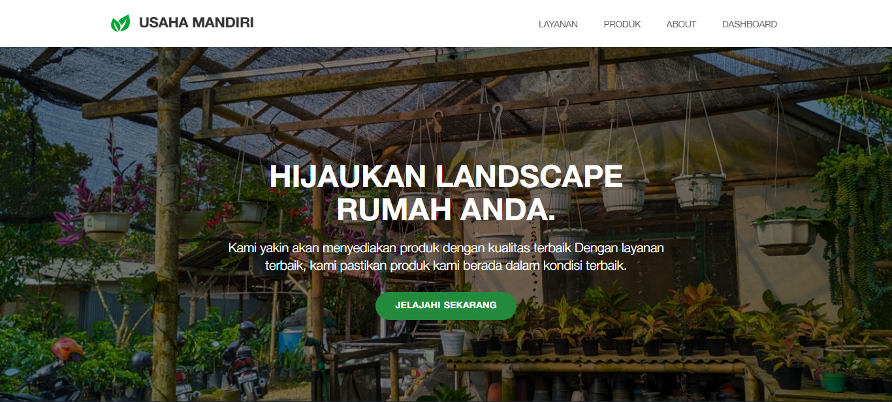

<!-- Improved compatibility of back to top link: See: https://github.com/othneildrew/Best-README-Template/pull/73 -->

<!--
*** Thanks for checking out the Best-README-Template. If you have a suggestion
*** that would make this better, please fork the repo and create a pull request
*** or simply open an issue with the tag "enhancement".
*** Don't forget to give the project a star!
*** Thanks again! Now go create something AMAZING! :D
-->

<!-- PROJECT SHIELDS -->
<!--
*** I'm using markdown "reference style" links for readability.
*** Reference links are enclosed in brackets [ ] instead of parentheses ( ).
*** See the bottom of this document for the declaration of the reference variables
*** for contributors-url, forks-url, etc. This is an optional, concise syntax you may use.
*** https://www.markdownguide.org/basic-syntax/#reference-style-links
-->

[![Contributors][contributors-shield]][contributors-url]
[![Forks][forks-shield]][forks-url]
[![Stargazers][stars-shield]][stars-url]
[![Issues][issues-shield]][issues-url]

<!-- PROJECT LOGO -->
 

  

<h3 align="center">Usaha Mandiri Front-end</h3>

  

    Welcome to the Usaha Mandiri website project! This is a full-stack web application built using the MERN stack (MongoDB, Express.js, React.js, Node.js). The project provides an online platform for Usaha Mandiri, offering a wide range of agricultural and gardening products.
     
    <a href="https://github.com/anemonastrum/usahamandiri-frontend"><strong>Explore the docs »</strong></a>
     
     
    <a href="https://github.com/anemonastrum/usahamandiri-frontend">View Demo</a>
    ·
    <a href="https://github.com/anemonastrum/usahamandiri-frontend/issues/new?labels=bug&template=bug-report---.md">Report Bug</a>
    ·
    <a href="https://github.com/anemonastrum/usahamandiri-frontend/issues/new?labels=enhancement&template=feature-request---.md">Request Feature</a>
  

<!-- ABOUT THE PROJECT -->
## About The Project

### Built With

* [![React][React.js]][React-url]
* [![Bootstrap][Bootstrap.com]][Bootstrap-url]
* [![JQuery][JQuery.com]][JQuery-url]

## Features

- User-friendly landing page showcasing Usaha Mandiri's excellences.
- Product listing with details and category filtering.
- Admin dashboard for product, categories management (add, update, delete).
- Admin view for user and admin list, information tab (edit).
- Authentication for both users and admins using JWT.
- Smooth navigation and responsive design.

<!-- GETTING STARTED -->
## Getting Started

### Prerequisites

### Installation

<!-- USAGE EXAMPLES -->
## Usage

<!-- CONTRIBUTING -->
## Contributing

Contributions are what make the open source community such an amazing place to learn, inspire, and create. Any contributions you make are **greatly appreciated**.

If you have a suggestion that would make this better, please fork the repo and create a pull request. You can also simply open an issue with the tag "enhancement".
Don't forget to give the project a star! Thanks again!

1. Fork the Project
2. Create your Feature Branch (`git checkout -b feature/AmazingFeature`)
3. Commit your Changes (`git commit -m 'Add some AmazingFeature'`)
4. Push to the Branch (`git push origin feature/AmazingFeature`)
5. Open a Pull Request

<!-- MARKDOWN LINKS & IMAGES -->
<!-- https://www.markdownguide.org/basic-syntax/#reference-style-links -->
[contributors-shield]: https://img.shields.io/github/contributors/anemonastrum/usahamandiri-frontend.svg?style=for-the-badge
[contributors-url]: https://github.com/anemonastrum/usahamandiri-frontend/graphs/contributors
[forks-shield]: https://img.shields.io/github/forks/anemonastrum/usahamandiri-frontend.svg?style=for-the-badge
[forks-url]: https://github.com/anemonastrum/usahamandiri-frontend/network/members
[stars-shield]: https://img.shields.io/github/stars/anemonastrum/usahamandiri-frontend.svg?style=for-the-badge
[stars-url]: https://github.com/anemonastrum/usahamandiri-frontend/stargazers
[issues-shield]: https://img.shields.io/github/issues/anemonastrum/usahamandiri-frontend.svg?style=for-the-badge
[issues-url]: https://github.com/anemonastrum/usahamandiri-frontend/issues
[license-shield]: https://img.shields.io/github/license/anemonastrum/usahamandiri-frontend.svg?style=for-the-badge
[license-url]: https://github.com/anemonastrum/usahamandiri-frontend/blob/master/LICENSE.txt
[linkedin-shield]: https://img.shields.io/badge/-LinkedIn-black.svg?style=for-the-badge&logo=linkedin&colorB=555
[linkedin-url]: https://linkedin.com/in/linkedin_username
[product-screenshot]: images/screenshot.png
[Next.js]: https://img.shields.io/badge/next.js-000000?style=for-the-badge&logo=nextdotjs&logoColor=white
[Next-url]: https://nextjs.org/
[React.js]: https://img.shields.io/badge/React-20232A?style=for-the-badge&logo=react&logoColor=61DAFB
[React-url]: https://reactjs.org/
[Vue.js]: https://img.shields.io/badge/Vue.js-35495E?style=for-the-badge&logo=vuedotjs&logoColor=4FC08D
[Vue-url]: https://vuejs.org/
[Angular.io]: https://img.shields.io/badge/Angular-DD0031?style=for-the-badge&logo=angular&logoColor=white
[Angular-url]: https://angular.io/
[Svelte.dev]: https://img.shields.io/badge/Svelte-4A4A55?style=for-the-badge&logo=svelte&logoColor=FF3E00
[Svelte-url]: https://svelte.dev/
[Laravel.com]: https://img.shields.io/badge/Laravel-FF2D20?style=for-the-badge&logo=laravel&logoColor=white
[Laravel-url]: https://laravel.com
[Bootstrap.com]: https://img.shields.io/badge/Bootstrap-563D7C?style=for-the-badge&logo=bootstrap&logoColor=white
[Bootstrap-url]: https://getbootstrap.com
[JQuery.com]: https://img.shields.io/badge/jQuery-0769AD?style=for-the-badge&logo=jquery&logoColor=white
[JQuery-url]: https://jquery.com 